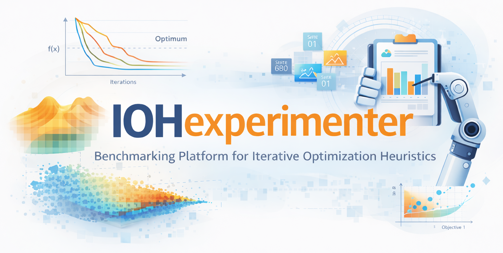

<p align="center">
  
</p>
<hr>


**Experimenter** for **I**terative **O**ptimization **H**euristics (IOHs), built in* `C++`.

* **Documentation**: [https://iohprofiler.github.io/IOHexperimenter](https://iohprofiler.github.io/IOHexperimenter).
* **Publication**: [https://arxiv.org/abs/1810.05281](https://arxiv.org/abs/1810.05281).
* **Wiki page**: [https://iohprofiler.github.io](https://iohprofiler.github.io/).

**IOHexperimenter** *provides*:

* A framework to ease the benchmarking of any iterative optimization heuristic.
* [Pseudo-Boolean Optimization (PBO)](https://iohprofiler.github.io/IOHproblem/) problem set (25 pseudo-Boolean problems).
* Integration of the well-known [Black-black Optimization Benchmarking (BBOB)](https://github.com/numbbo/coco) problem set (24 continuous problems).
* [W-model](https://dl.acm.org/doi/abs/10.1145/3205651.3208240?casa_token=S4U_Pi9f6MwAAAAA:U9ztNTPwmupT8K3GamWZfBL7-8fqjxPtr_kprv51vdwA-REsp0EyOFGa99BtbANb0XbqyrVg795hIw) problem sets constructed on OneMax and LeadingOnes.
* Integration of the [Tree Decomposition (TD) Mk Landscapes](https://github.com/tobiasvandriessel/problem-generator) problems.
* Submodular optimization problems, as seen in the [GECCO '22 workshop](https://cs.adelaide.edu.au/~optlog/CompetitionESO2022.php).
* Several benchmark suites from the CEC conference.
* Flexible interface for adding new suites and problems.
* Advanced logging module that takes care of registering the data in a seamless manner.
* Data format is compatible with [IOHanalyzer](https://github.com/IOHprofiler/IOHanalyzer).
* Dynamic BinVal functions ([paper](https://link.springer.com/article/10.1007/s42979-022-01203-z))
* Double funnel functions ([paper](https://link.springer.com/chapter/10.1007/978-3-540-87700-4_50))


**Available Problem Suites:**

* BBOB (Single Objective Noiseless) (COCO)
* SBOX-COST (COCO)
* StarDiscrepancy
* PBO
* Submodular Graph Problems
* CEC 2013 Special Session and Competition on Niching Methods for Multimodal Function Optimization
* CEC 2022 Special Session and Competition on Single Objective Bound Constrained Numerical Optimization

## C++

The complete API documentation, can be found [here](https://iohprofiler.github.io/IOHexperimenter/cpp), as well as a Getting-Started guide. In addition to the documentation, some example projects can be found in the [example](https://github.com/IOHprofiler/IOHexperimenter/tree/master/example/) folder of this repository.

## Python

The pip-version of IOHexperimenters python interface is available via [pip](https://pypi.org/project/ioh). A tutorial with python in the form of a jupyter notebook can be found in the example folder of [this repository](https://github.com/IOHprofiler/IOHexperimenter/tree/master/example/tutorial.ipynb).
A Getting-Started guide and the full API documentation can be found [here](https://iohprofiler.github.io/IOHexperimenter/python).

## Contact

If you have any questions, comments or suggestions, please don't hesitate contacting us <IOHprofiler@liacs.leidenuniv.nl>.

### Our team

* [Jacob de Nobel](https://www.universiteitleiden.nl/en/staffmembers/jacob-de-nobel), *Leiden Institute of Advanced Computer Science*,
* [Furong Ye](https://www.universiteitleiden.nl/en/staffmembers/furong-ye#tab-1), *Leiden Institute of Advanced Computer Science*,
* [Diederick Vermetten](https://www.universiteitleiden.nl/en/staffmembers/diederick-vermetten#tab-1), *Leiden Institute of Advanced Computer Science*,
* [Hao Wang](https://www.universiteitleiden.nl/en/staffmembers/hao-wang#tab-1), *Leiden Institute of Advanced Computer Science*,
* [Carola Doerr](http://www-desir.lip6.fr/~doerr/), *CNRS and Sorbonne University*,
* [Thomas Bäck](https://www.universiteitleiden.nl/en/staffmembers/thomas-back#tab-1), *Leiden Institute of Advanced Computer Science*,

When using IOHprofiler and parts thereof, please kindly cite this work as

Jacob de Nobel, Furong Ye, Diederick Vermetten, Hao Wang, Carola Doerr and Thomas Bäck,
*IOHexperimenter: Benchmarking Platform for Iterative Optimization Heuristics*, arXiv e-prints:2111.04077, 2021.

```bibtex
@ARTICLE{denobel2024IOHexperimenter,
  author={de Nobel, Jacob and Ye, Furong and Vermetten, Diederick and Wang, Hao and Doerr, Carola and Bäck, Thomas},
  journal={Evolutionary Computation}, 
  title={IOHexperimenter: Benchmarking Platform for Iterative Optimization Heuristics}, 
  year={2024},
  volume={32},
  number={3},
  pages={205-210},
  keywords={Iterative optimization heuristics;benchmarking;algorithm comparison},
  doi={10.1162/evco_a_00342}
}
```
